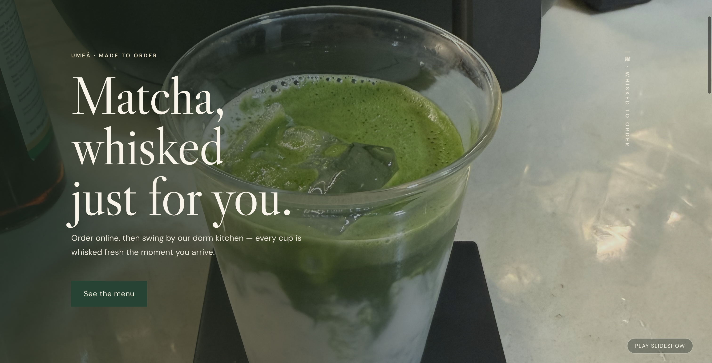
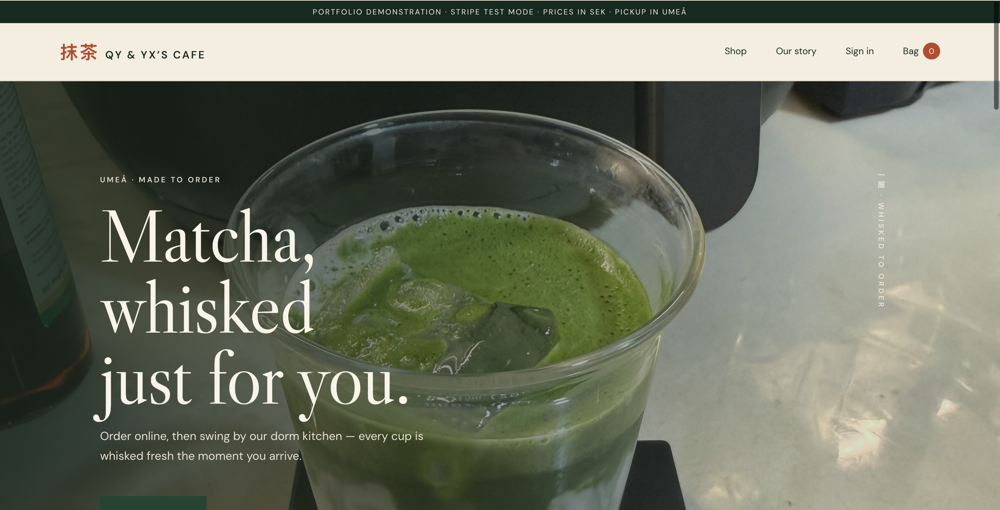
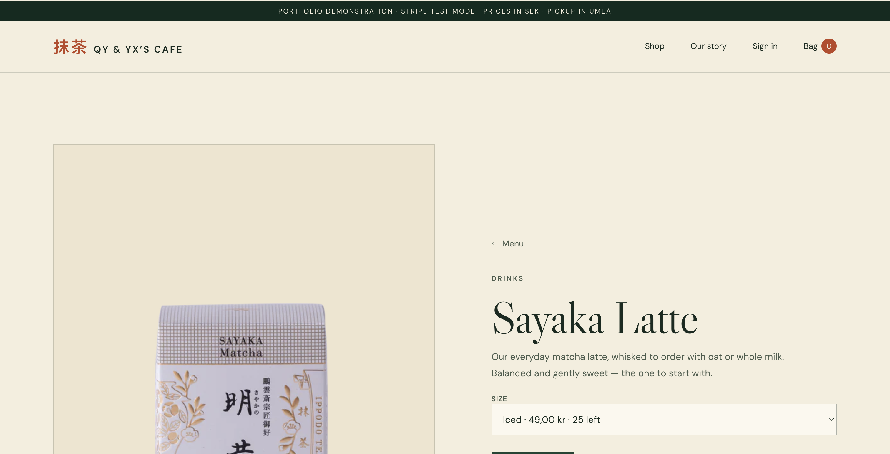
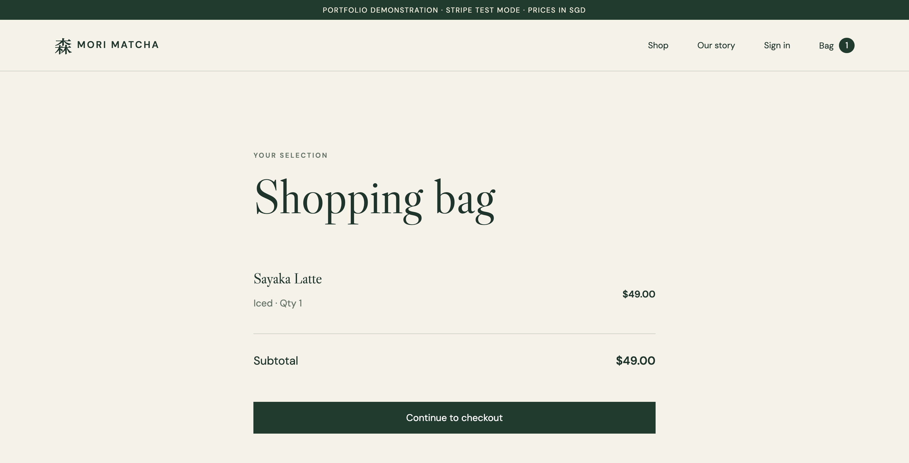
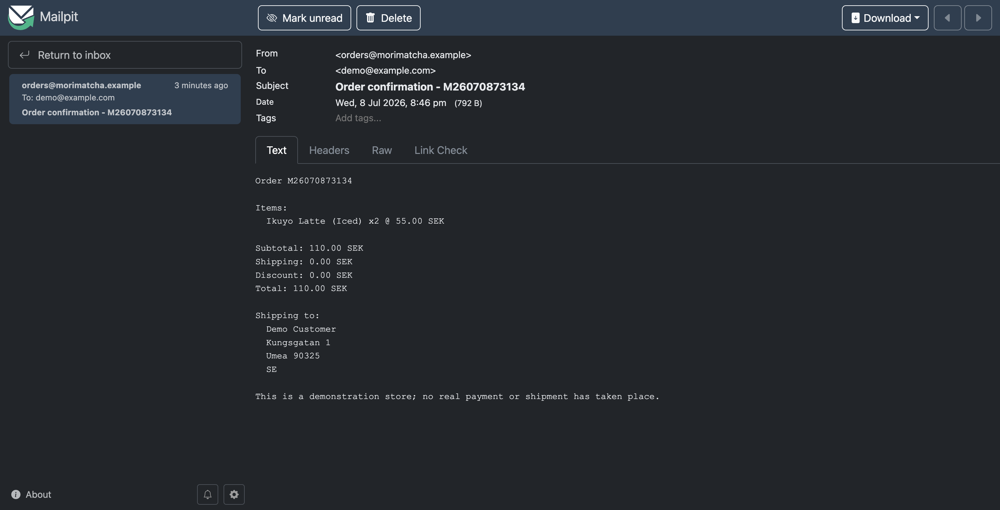
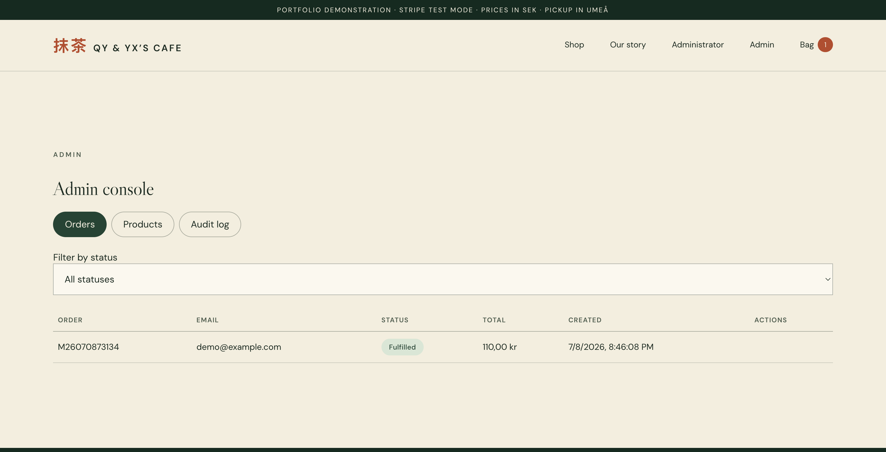
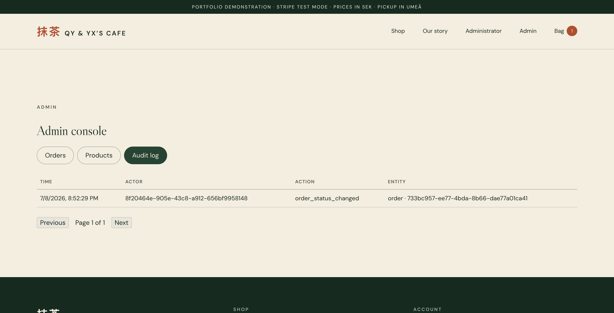

# QY & YX's Cafe — matcha drinks, Umeå

The online store for a real one-person matcha café run from a dormitory kitchen in Umeå,
Sweden: drinks whisked to order, picked up in person, with a small take-home shelf of tins
and tools. It doubles as a portfolio project showing the path from a beginner Flask
prototype (the café's first site, kept in `app/`) to a production-shaped system: typed API
contracts, transactional inventory, test-mode payments, transactional email, infrastructure
as code, and CI that guards all of it.

**Stack:** FastAPI + SQLAlchemy 2.0 + PostgreSQL · React 19 + TypeScript + Vite · Stripe (test
mode) · Terraform on AWS (S3/CloudFront, ECS Fargate, RDS) · GitHub Actions CI/CD.

Prices are in SEK. Payments run in Stripe test mode only — the plan for going live is Stripe
with cards + Swish (Stripe supports Swish natively in SEK) plus a pay-at-pickup option.
Taxes and returns automation are out of scope.

## Repository layout

| Path | What it is |
|---|---|
| `apps/api` | FastAPI backend: catalog, cart, checkout, orders, Stripe webhooks |
| `apps/web` | React storefront with types generated from the API's OpenAPI contract |
| `infra/` | Terraform: static site (S3+CloudFront), ECS/ALB/RDS demo environment, budget alarms |
| `docs/` | Architecture, operations, walkthrough, and five ADRs recording key decisions |
| `app/`, `run.py` | The original Flask/SQLite café — kept as a runnable v1 reference ([its full docs](docs/legacy-cafe.md)) |

## Highlights worth reading

- **Inventory that can't oversell** — checkout locks variant rows (`SELECT … FOR UPDATE`),
  reprices server-side (client prices are never trusted), reserves stock separately from
  on-hand stock, and writes an audit trail (`apps/api/app/services/checkout.py`).
- **Payments where the webhook is the source of truth** — only a signature-verified Stripe
  webhook can mark an order paid; redirect pages are presentation only. Events are recorded
  for idempotency ([ADR 0004](docs/adr/0004-stripe-webhooks.md)).
- **Opaque server-side sessions** — random tokens stored as SHA-256 hashes, httponly cookies,
  CSRF via double-submit header; JWTs deliberately rejected ([ADR 0001](docs/adr/0001-opaque-sessions.md)).
- **A contract the compiler enforces** — the frontend's API types are generated from
  `openapi.json`; CI fails if the committed contract drifts from the code, and the frontend
  fails to compile if it drifts from the contract ([ADR 0002](docs/adr/0002-rest-contract.md)).

## Quick start

Prerequisites: Docker (simplest), or Python 3.12 + Node 22 for the manual path.

```bash
docker compose up --build
```

Compose runs migrations and an idempotent seed before starting the API. Storefront:
`http://localhost:5173` · API docs: `http://localhost:8001/docs` · Mailpit (local email
inbox — order confirmations land here): `http://localhost:8025`.

To get a store admin account, set both of these in `.env` before the seed runs
(see `.env.example`); the seed creates or promotes that user idempotently — there are
no built-in admin credentials:

```bash
ADMIN_EMAIL=you@example.com
ADMIN_PASSWORD=choose-a-password
```

Manual development setup:

```bash
python3 -m venv .venv
.venv/bin/pip install -e 'apps/api[dev]'
cd apps/web && npm install && cd ../..
docker compose up -d postgres
make migrate && make seed
make api    # terminal 1 — FastAPI on :8001
make web    # terminal 2 — Vite dev server on :5173
```

Useful commands:

```bash
make test       # legacy, API, and frontend suites
make lint       # ruff + eslint
make openapi    # regenerate the API contract + frontend type declarations
```

Docs: [architecture](docs/architecture.md) · [operations](docs/operations.md) ·
[walkthrough](docs/walkthrough.md) · [external services](docs/external-services.md) ·
[legacy café guide](docs/legacy-cafe.md).

## Walkthrough

One order, end to end: browse the menu → bag → checkout → simulated payment → confirmation
email → admin fulfillment, with the audit log recording the admin action. (Payments run
in local demo mode — the simulator page stands in for Stripe; in a deployed environment
the Stripe-hosted checkout and webhook take its place, per
[ADR 0004](docs/adr/0004-stripe-checkout.md). Emails land in the Mailpit inbox locally,
per [ADR 0007](docs/adr/0007-transactional-email.md).)

| Home — real photos and the pour video in the hero | The menu |
| --- | --- |
|  |  |

| Drink page — photo gallery | Shopping bag |
| --- | --- |
|  |  |

| Order confirmation email | Admin — orders |
| --- | --- |
|  |  |

| Admin — audit log |
| --- |
|  |

The last screenshot is the point of the admin design: the order was marked fulfilled, and
the audit log shows *who* changed *what*, *when* — written in the same transaction as the
change itself ([ADR 0006](docs/adr/0006-admin-authorization.md)).

## Session status — end of 2026-07-08 (night): the store is now the real café

The store now serves its real purpose: **QY & YX's Cafe, matcha drinks for pickup in
Umeå**. What changed, all green in CI:

- **SEK everywhere**, done properly: `price_sgd_cents` renamed to `price_cents` via an
  Alembic migration, order currency defaults to SEK, Stripe line items in `sek`,
  `Intl.NumberFormat("sv-SE")` on the frontend. Sweden-only, pickup is free (0 kr).
- **The real menu**: Sayaka Latte (49 kr), Ikuyo Latte (55 kr) — iced/hot, with the actual
  photos — and Usucha (39 kr); the Uji tin and whisk remain as a take-home shelf.
- **The legacy site's photo/video carousel is back**: real drink photos + the pour video
  in the homepage hero (pausable, reduced-motion safe).
- **Payments direction** (decision, not yet code): Stripe supports **Swish** natively in
  SEK, so going live = real Stripe keys + enabling Swish in the dashboard; a
  pay-at-pickup option (Swish P2P/cash) comes with the pickup-slot milestone.
- **Browser testing found bug #2**: every admin mutation 422'd from the real UI — a
  fetch-options spread-order bug dropped `Content-Type` whenever the CSRF header was
  passed (log entry below). Fixed with regression tests.

**Next milestones (agreed):** pickup days/time slots at checkout (port the legacy
`pickup_days` model) with pay-online/pay-at-pickup choice; then shared stock pools
(drinks draw grams from one matcha tin, the legacy `stock_pools` idea).

Suite: 45 legacy + 63 API + 25 web = **133 tests**. Admin bootstrap now lives in `.env`
(`ADMIN_EMAIL`/`ADMIN_PASSWORD`, see `.env.example`) — the local DB was reset, so the
admin account is exactly what `.env` says, nothing hidden.

## Previous session status — end of 2026-07-08 (evening)

Three things landed today, all green in CI:

1. **Admin CSRF-on-GET bug** found by the browser walkthrough, fixed with regression
   tests (log entry below).
2. **Order confirmation email** ([ADR 0007](docs/adr/0007-transactional-email.md)):
   pluggable console/SMTP backend, sent after commit from both payment paths, never
   resent on webhook replays. Locally, emails arrive in Mailpit at `http://localhost:8025`.
   Admin bootstrap is now explicit: `ADMIN_EMAIL`/`ADMIN_PASSWORD` in `.env` (documented
   in `.env.example`) — the earlier `admin@example.com` / `demo-admin-pass-123` account
   exists only in the local database volume from a manual promotion.
3. **Storefront design refresh**: refined Japanese-editorial direction (washi texture,
   pine + persimmon accent, monoline SVG product illustrations, staggered reveal), the
   seed catalog expanded from 2 to 8 products, footer/breadcrumb/status-chip fixes.
   Gallery above shows the result.

Suite: 45 legacy + 63 API + 23 web = **131 tests**, all passing.

**Open decisions (yours):** merge PR #1; AWS deploy (`DEPLOY_ENABLED` + AWS secrets),
`domain_name` for HTTPS, Stripe test keys for the deployed environment. Still on the
roadmap: metrics/error tracking (Sentry), remote Terraform state, multi-AZ.
Run `docker compose down` when finished (add `-v` to reset data).

## Previous session status — morning of 2026-07-08

Overnight autonomous session ended when the usage limit was reached (~4:30am reset).

**Landed and green in CI (PR #1, branch `qiyueclaude`)** — three waves, all five CI checks
passing after each: reservation sweeper, OpenAPI-derived frontend types, CI web lint/tests,
CD workflow, optional ALB HTTPS, observability middleware, checkout/auth frontend tests,
DB-backed rate limiting, dependabot, SEO metadata, docs updates. Details in the engineering
log below.

**Interrupted mid-work (uncommitted changes left in the working tree — review before
committing or discard with `git checkout -- .`):**
- Legacy hardening (`app/`, `tests/`): pickup-slot capacity race fix, SQLite
  `PRAGMA foreign_keys=ON`, CSRF test-bypass removal. Code partially written, tests not run.
- Compose smoke-test CI job (`.github/workflows/ci.yml`): partially written, not validated.
- API test gaps (webhook idempotency, coupons, cart merge): not started — no files written.

**To resume tomorrow:** finish/verify the three interrupted items, then remaining roadmap:
merge PR #1, enable `DEPLOY_ENABLED` + AWS secrets for CD, set `domain_name` for HTTPS,
provision Stripe test keys to the deployed environment.

**Permission-blocked items:** none — nothing was skipped for permissions this session.

## Engineering log

A running record of significant changes, what each one did, and why it matters. Newest first.

### 2026-07-08 — The pivot: build the store the business actually needs

The modern stack had drifted into a fictional Singapore boutique while the *real* business
— matcha drinks picked up at a dorm in Umeå — was sitting in the legacy app the whole
time, schema and all (pickup slots, shared stock pools, a payment-method column). The
pivot re-grounded the modern store in reality:

- **Currency is a rename, not a constant.** SGD was baked into a *column name*
  (`price_sgd_cents`). De-branding it to `price_cents` + a `currency` field took one
  Alembic `alter_column` migration and a mechanical sweep — cheap now, and the next
  currency change is config. Lesson: never encode a business assumption in an identifier.
- **Payment methods are a market question.** In Sweden the answer is Swish (every student
  has it) + cards; Stripe supports both in SEK, so the existing Stripe integration already
  covers the online path — going live is keys + a dashboard toggle, zero architecture.
  Pay-at-pickup (the legacy app's "cash" flow) returns with the pickup-slot milestone.
- **Content is design.** The single biggest realism gain wasn't code: it was the owner's
  actual latte photos and pour video in the hero, and a menu of drinks that exist.

### 2026-07-08 — Second bug the browser found: a spread that ate a header

Every admin mutation failed with 422 from the real UI — while all tests passed. In the
API client, `fetch` options were merged as `{ headers: {...defaults}, ...options }`:
spreading `options` *after* `headers` meant any caller passing its own headers (all admin
mutations pass `X-CSRF-Token`) replaced the whole headers object and silently dropped
`Content-Type: application/json`. FastAPI refused the body; the 422's structured `detail`
array then rendered as "[object Object]" because the error path assumed `detail` was a
string. One spread, two bugs.

Fixes: spread `options` first and merge headers last; stringify non-string error details.
Regression tests assert the merged headers and the readable message. Same moral as the
CSRF-on-GET bug: unit tests that mock the transport encode the author's assumptions —
only exercising the real client against the real server catches contract mismatches.

### 2026-07-08 — Order confirmation email: a side effect that must not lie

Paying an order now sends a plain-text receipt. The interesting part is *when* it sends
([ADR 0007](docs/adr/0007-transactional-email.md)):

- **After the commit, never inside the transaction.** An SMTP call mid-transaction holds
  row locks for the duration of a network round-trip, and a rollback after a send means
  the customer got a confirmation for an order that never happened. The email is
  dispatched only once `db.commit()` has succeeded.
- **Only when *this request* made the order paid.** Stripe delivers webhooks
  at-least-once; a replayed `checkout.session.completed` that no-ops must not resend.
  The transition is detected before `mark_order_paid` and the send is gated on it.
- **A failed send never fails the request.** Otherwise Stripe would retry the webhook and
  a mail outage would double-process payments. Failures are logged and dropped —
  at-most-once delivery, accepted for a demo; the production upgrade is a transactional
  outbox (write the pending email in the same transaction, deliver from a worker).
- Locally, compose now runs [Mailpit](https://mailpit.axllent.org/) — a fake SMTP server
  with a web inbox at `http://localhost:8025`, so "did the email send" is something you
  can *see* instead of infer from logs.

### 2026-07-08 — Design refresh: what "AI-looking" actually was

The storefront worked but felt undone. The audit said why: 79 lines of CSS for the whole
app, kanji-on-a-colored-block placeholders where product images should be, a two-product
catalog, no texture, no motion. The fixes, in order of impact:

- **Catalog content**: 2 products → 8 (11 variants) with believable copy. No amount of
  CSS makes a two-item shop look real. The seed became idempotent *per product* (insert
  missing slugs only) instead of skip-if-anything-exists, so existing databases pick up
  the new items on the next seed run.
- **Product art**: a `ProductArt` component mapping slug/category to monoline SVG
  illustrations (tin, whisk, bowl, scoop, sifter, leaf) on tinted paper — deliberate
  art direction instead of a missing-image fallback.
- **A committed direction**: washi-cream base, deep pine, one burnt-persimmon accent,
  hairline rules, a ghosted enso in the hero, SVG-noise grain, tightened display type,
  one staggered card reveal. Distinctive choices executed consistently read as designed;
  evenly-hedged defaults read as generated.
- Kept honest: all 23 web tests pass unchanged (they query semantics — roles, labels,
  text — not pixels), lint and production build clean, reduced-motion respected, no new
  dependencies.

### 2026-07-08 — The admin console rendered empty tables: CSRF checks belong on writes, not reads

The end-to-end browser walkthrough — not the 100+ passing tests — caught this one. Every
admin list view (orders, audit log) came back 403 in a real browser: `admin_session` was
built on top of the CSRF dependency, so even GET requests demanded an `X-CSRF-Token`
header. The frontend correctly sends that header only on mutations, because CSRF is an
attack on *state changes* — a forged cross-site GET can't read the response
(same-origin policy), so safe methods don't need the token.

Fix: split the dependency — `admin_session` (role check only) guards the GET routes,
`admin_csrf_session` (role + CSRF) guards every mutation. The OpenAPI contract and
generated frontend types shifted with it, which the contract-drift CI check would have
flagged had it been forgotten.

Two lessons worth keeping:
- **Why didn't the tests catch it?** Every admin test attached the CSRF header on GETs
  too — the tests encoded the bug's assumption. The regression tests now assert the
  *absence* of the header works for reads and fails for writes. Tests that only exercise
  the happy path a developer imagined will happily pass a broken contract; an end-to-end
  pass with the real client is what exposes mismatched assumptions between frontend
  and backend.
- **Layered dependencies read nicely but compose invisibly.** `admin_session` →
  `csrf_session` → `current_session` looked clean; the cost was that "admin" silently
  implied "CSRF" everywhere it was used. When a dependency chain encodes policy, each
  link needs to be a deliberate decision per route class, not an accident of reuse.

### 2026-07-08 — New tests immediately caught two real bugs

Filling known test gaps (webhook signature/idempotency, coupon arithmetic, cart merge)
surfaced two live defects, both fixed:

- **Cart merge silently lost items.** Re-homing a guest cart item by assigning its foreign
  key went behind the ORM's back: SQLAlchemy's `delete-orphan` cascade tracks the loaded
  *collection*, not the FK column, so deleting the guest cart still deleted the "moved" item.
  A user signing in at checkout lost their cart. Fix: move items through the relationship
  (`guest_cart.items.remove(...)` / `account_cart.items.append(...)`). *Lesson: with an ORM,
  express ownership changes through the relationship, never by writing FK columns directly.*
- **UUID lookups worked by driver coincidence.** `db.get(Order, "<string>")` happens to work
  on Postgres because psycopg coerces strings; on SQLite it crashes. Correctness that depends
  on which database driver you run isn't correctness. Ids are now parsed explicitly — 404 for
  invalid path params, logged skip for malformed webhook metadata (never a 500).

The compose smoke-test job took three CI rounds to go green, both failures being
environment truths rather than app bugs: (1) Linux runners enforce uid ownership on bind
mounts, so the non-root container couldn't create its SQLite file (macOS Docker hides
this); (2) the legacy app correctly refused to boot when CI supplied no admin credentials
— the guard worked, CI had to provide a real value. *Lesson: e2e failures peel like an
onion — each fix reveals the next thing the boot sequence needs.*

Also landed today: legacy hardening (slot-capacity check moved inside the transaction —
the classic check-then-act race; SQLite FK enforcement on; CSRF test bypass removed with
real tokens in tests), the compose smoke-test CI job, and
[docs/system-design.md](docs/system-design.md) — an interview-prep guide mapping system
design topics to real code in this repo.

### 2026-07-07 (night) — Hardening wave

**Database-backed rate limiting** (`apps/api/app/services/rate_limit.py`, migration
`1c2f8a9d4e6b`). The auth rate limiter was an in-process dict — each Gunicorn worker or
Fargate replica had its own counter, so the real limit was `10 × number_of_processes` and
reset on every restart. Attempts are now recorded in a `rate_limit_events` table: one shared
counter no matter how many replicas, with stale events pruned on each check so the table
can't grow unboundedly. *Lesson: any state that must be enforced globally (rate limits,
sessions, locks) cannot live in process memory once you scale past one process.*

**Dependabot** (`.github/dependabot.yml`). Weekly grouped update PRs across all six
ecosystems in the repo (pip ×2, npm, GitHub Actions, Terraform, Docker). *Lesson: unpatched
dependencies are how most real sites get compromised; automation beats discipline.*

**Storefront SEO/metadata** (`apps/web/index.html`, `public/`). Title, meta description,
Open Graph/Twitter cards, SVG favicon, robots.txt, and a `<noscript>` fallback — the
difference between a link that unfurls properly when shared and a blank card.

**Docs updated** — `docs/operations.md` and `docs/architecture.md` now document the CD
workflow, HTTPS variables, sweeper knob, and request-ID log correlation.

### 2026-07-07 (evening) — Deployability and observability wave

**CD pipeline** (`.github/workflows/deploy.yml`). On every push to `main`: build the API
image, push to ECR tagged with the git SHA, then deploy by rendering a *new ECS task-definition
revision pinned to that exact image* — not `--force-new-deployment` on `:latest`, which would
redeploy "whatever latest happens to be" with no rollback trail. Gated behind a
`DEPLOY_ENABLED` repository variable so the workflow skips (grey, not red) until AWS
credentials are configured. *Lesson: deploys should be immutable and auditable — a SHA-pinned
revision is both a receipt and an undo button.*

**HTTPS for the API** (`infra/environments/demo`). The ALB previously spoke plain HTTP :80 —
the single biggest "not actually production" gap. Now setting `domain_name` provisions an ACM
certificate (DNS-validated, automatically if `hosted_zone_id` is given), a TLS 1.3 :443
listener, and converts :80 into a 301 redirect. With no domain set, behavior is unchanged, so
the config still applies for demo users. *Lesson: TLS terminates at the load balancer; the
cert is free (ACM) — the real work is DNS validation proving you own the domain.*

**Observability middleware** (`apps/api/app/observability.py`). Every response now carries an
`X-Request-ID` (accepted from the caller or generated), every request logs one structured
access line (method, path, status, duration), optionally as JSON (`JSON_LOGS=1`) for log
aggregators, and every response gets security headers (nosniff, frame-deny, referrer policy,
HSTS only under secure-cookie config). Implemented as pure ASGI middleware so streaming and
error responses are covered too. *Lesson: request IDs are the thread you pull when debugging
distributed systems — the ID in the user's error report finds the exact log lines.*

**Checkout and auth flow tests** (`apps/web`, 7 → 14 tests). The two riskiest user flows —
paying and signing in — now have tests covering validation, exact API payloads, redirects,
and error display. Along the way, a latent test-infrastructure bug: Testing Library's
automatic DOM cleanup silently never ran (it requires Vitest globals, which this project
doesn't enable), so DOM leaked between tests and could satisfy queries by accident. Explicit
`cleanup()` fixed it. *Lesson: a test suite that can pass by accident is worse than a smaller
honest one.*

**README restructured** — legacy café tutorial moved to `docs/legacy-cafe.md`; this file now
leads with what the project demonstrates.

### 2026-07-07 — First CI run, and everything it caught

**Reservation-expiry sweeper** (`apps/api/app/services/checkout.py`, `main.py`). Checkout
reserves stock and relies on Stripe's `checkout.session.expired` webhook to release it — but
webhooks are push-based and can never be the *only* mechanism (no Stripe configured = stock
reserved forever). Added `expire_stale_orders()`, an idempotent function that releases
reservations on pending orders past their deadline, driven by a background loop in the FastAPI
lifespan (`RESERVATION_SWEEP_INTERVAL_SECONDS`, default 300; `0` disables it for tests). The
DB work runs via `asyncio.to_thread` so it never blocks the event loop — async functions don't
make blocking code non-blocking. *Lesson: every webhook needs a reconciliation job backstop.*

**Frontend now consumes the generated OpenAPI types** (`apps/web/src/api/client.ts`). The types
were hand-copied duplicates of the contract; CI checked the contract but nothing forced the app
to obey it. Now `Product`, `Cart`, `Order` etc. are aliases into the generated
`components["schemas"]`, so a backend contract change breaks the frontend at compile time
instead of at runtime. Found on arrival: the hand-written types were *stricter* than the
contract (literal `"SGD"` vs `string`) — assumptions the backend never guaranteed.

**Real frontend tests** — jsdom + Testing Library wired into Vitest; catalog, cart, and API
error-handling tests replace a suite that previously covered only a currency formatter.

**CI actually guards the frontend** (`.github/workflows/ci.yml`) — the web job ran only
`npm run build`; lint and tests now run first. CI only proves what it runs.

**First-ever CI run: 3/5 green, and both failures were real.**
- *terraform job*: `variables.tf` used semicolons inside single-line HCL blocks — invalid
  syntax that had never been caught because Terraform had never been executed anywhere.
  Fixed to canonical multi-line blocks, then a second failure: `terraform fmt -check`
  enforces canonical *formatting* (like gofmt), fixed by running the formatter.
- *contract job*: the committed `openapi.json` was stale — the API code had grown a cart
  cookie parameter and orders endpoints that were never regenerated. The drift check did
  exactly its job on its first run. Fixed with `make openapi`.
- Bonus lesson: a local `terraform init` pulled a 648 MB provider binary into `.terraform/`
  which accidentally got committed — GitHub rejected the push (100 MB limit). `.terraform/`
  is local cache and is now gitignored; `.terraform.lock.hcl` (version + checksum pins, the
  `package-lock.json` of Terraform) *is* committed.

*The meta-lesson of the day: "works on my machine" only covers what's installed on your
machine. CI is the machine that never forgets to check.*

### Earlier — the v1 → v2 rewrite

The project began as a server-rendered Flask/SQLite café for a real ~50-user use case
(pickup slots, cash/Tikkie payment, admin dashboard) — see the
[legacy café guide](docs/legacy-cafe.md) for its full history and learning notes. The modern
stack was then designed around the questions the prototype couldn't answer: concurrent-safe
inventory, real payment flows, typed API contracts, repeatable infrastructure, and CI. The
five [ADRs](docs/adr/) record those decisions.

## Known limitations (deliberate scope)

- Demo/test payments only; no live Stripe keys, taxes, duties, or currency conversion.
- Single-AZ RDS and `desired_count = 1` — a documented cost tradeoff ([ADR 0005](docs/adr/0005-aws-topology.md)).
- Rate limiting is in-process (not distributed); observability is CloudWatch logs plus
  structured request logging.

## Notes

This README is updated as the project evolves; the engineering log above is the change record.
