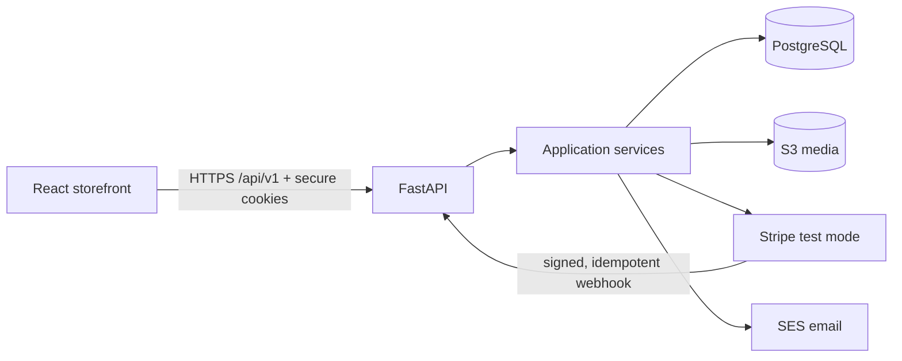

# Architecture

The modern store lives beside the unchanged Flask application. PostgreSQL is the modern
system of record; the legacy SQLite data is intentionally not migrated.



Dependency direction is HTTP routes → application services → domain rules → SQLAlchemy
repositories/database. The HTTP layer never accepts authoritative price or total fields.

## Checkout data flow

```mermaid
sequenceDiagram
  participant R as React
  participant A as FastAPI
  participant P as PostgreSQL
  participant S as Stripe
  R->>A: POST /checkout (address, coupon)
  A->>P: lock variants; validate stock, shipping, coupon
  A->>P: create pending order + snapshots + reservations
  A->>S: create test Checkout Session with order_id metadata
  A-->>R: checkout URL
  S->>A: signed checkout.session.completed
  A->>P: record event; consume reservation; mark paid
```

The webhook event identifier is stored in `processed_webhooks` in the same transaction as
the state change. Duplicate delivery is a no-op. A browser redirect cannot mark an order paid.

## Glossary

- **Available stock:** on-hand units minus units held by active reservations.
- **Reservation:** a bounded stock hold attached to a pending order.
- **Snapshot:** immutable name, SKU and price copied onto an order item.
- **Guest lookup token:** a high-entropy secret whose hash is stored with a guest order.
- **Opaque session:** a random revocable token; identity and role remain server-side.
